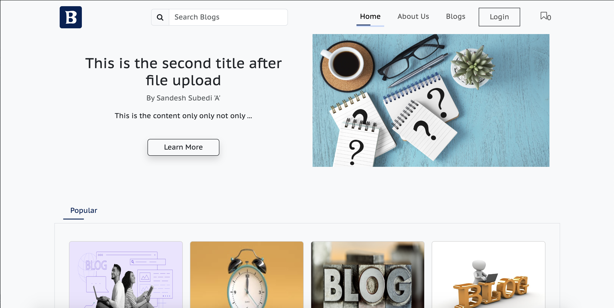

# Blog Application

The MERN Blog Application is a full-stack web application designed to provide users with a platform for creating, publishing, and managing their own blogs. Built on the MERN (MongoDB, Express.js, React.js, Node.js) stack, this application offers a seamless and responsive blogging experience.

    # Key Features:

        1. User Authentication: Users can sign up, log in, and manage their accounts securely. Authentication is implemented using JSON Web Tokens (JWT) for enhanced security.

        2. Create and Publish Blogs: Registered users can create new blog posts, write content , and publish their posts to share their thoughts and ideas with the community.

        3. Browse and Read Blogs: Visitors can browse through the list of published blog posts, search for specific topics, and read full blog articles. The application offers a user-friendly interface for easy navigation.

        4. Commenting System: Users can engage with blog posts by leaving comments, fostering discussions, and interacting with other readers. Comments are displayed below each blog post for easy access.

        5. Responsive Design: The application is designed to be fully responsive, ensuring a seamless user experience across various devices and screen sizes, including desktops, tablets, and smartphones.

        6. Admin Panel: Administrators have access to an admin panel where they can view list of all the  users but their password is kept secure, and view all the blogs and can delete and edit the blog if necessary. But normal users can only post the blogs and view the blogs published by them. Beside this they can also view their profile and do the necessary update intheir profile if necessary.

This Blog Application aims to provide an intuitive and feature-rich platform for both bloggers and readers alike. Whether you're a seasoned writer looking to share your expertise or a curious reader exploring new topics, this application offers a versatile and engaging blogging experience.

# Installation

To run the MERN Blog Application locally on your computer, you need to follow following steps:

Prerequisites:

1. Insall Node.js and npm on your machine. You can download and install them from [Node.js official website](https://nodejs.org/).

2. Install MongoDb and run on your computer or access via a remote server. You can download and install MongoDB Community Server From the [MongoDB official website](https://www.mongodb.com/try/download/community).

Setup Instructions:

    1. Clone the Repository

        git clone git@github.com:suraz-101/BlogApplication.git

Open terminal on your project

    2. Navigate to the Project Directory:

        cd BlogApplication

    3. Navigate to Server :

        cd server

    4. Open another terminal on the same project and run following code to navigate to frontend

        cd client

    5. Set Up Environement Variable on server

         1. In the 'server' directory, create a '.env' file and define the environment variables that are mentioned in '.env.example' file of the server

    6. Install all the dependencies and devDependensies  that are mentioned on server side file called 'package.json'

        npm i <dependency name> --save  => run this code to download the packages mentioned on dependencies

        npm i <dependecy name> --save -dev   => run this code to download the packages mentioned on devDependecies

    7. Iinstall all the dependencies  that are mentioned on server side file called 'package.json'

         npm i <dependency name> --save  => run this code to download the packages mentioned on dependencies

    8. start server

        npm run dev

    9. start client

        npm run dev

    10. Access the application

        - Open your web browser and navigate to "link mentioned after running npm run dev in client terminal" to access the blog application

To setup mongodb and to copy the url of you mongodb please watch [youtube videos](https://www.youtube.com/)

Note: Ensure that MongoDB is running before starting the backend server. You can start MongoDB using the mongod command in a separate terminal window.

These installation instructions should guide users through setting up the MERN Blog Application project locally on their machine. Adjust the steps as needed based on your project's structure and dependencies.

# Technologies used

1. MongoDB: A NoSQL database used for storing blog posts, user information, and other data related to the application.

2. Express.js: A web application framework for Node.js used to build the backend server and API endpoints for handling HTTP requests and responses.

3. React.js: A JavaScript library for building user interfaces. In this project, React.js is used to create the frontend interface of the blog application, including components for displaying blog posts, user authentication, and more.

4. Node.js: A JavaScript runtime environment used for running server-side code. In this project, Node.js is used to host the backend server that serves the RESTful API and interacts with the database.

5. Axios: A promise-based HTTP client for making HTTP requests from the frontend React.js components to the backend Express.js server.

6. Redux-tool-kit: A predictable state container for JavaScript applications. Redux is used for managing application state in a centralized store, enabling efficient data management and state synchronization across components.

7. React Router: A library for declarative routing in React.js applications. React Router is used to handle client-side routing and navigation within the blog application.

8. JWT (JSON Web Tokens): A standard for securely transmitting information between parties as a JSON object. JWTs are used for user authentication and authorization in the blog application.

9. Mongoose: An Object Data Modeling (ODM) library for MongoDB and Node.js. Mongoose is used to define schemas, models, and interact with the MongoDB database in a more structured way.

# Some ScreenShots :

These are just for demo :

1. Home age

2. Blog Page

# React + Vite

Vite is used to run the react project during developement

This template provides a minimal setup to get React working in Vite with HMR and some ESLint rules.

Currently, two official plugins are available:

- [@vitejs/plugin-react](https://github.com/vitejs/vite-plugin-react/blob/main/packages/plugin-react/README.md) uses [Babel](https://babeljs.io/) for Fast Refresh
- [@vitejs/plugin-react-swc](https://github.com/vitejs/vite-plugin-react-swc) uses [SWC](https://swc.rs/) for Fast Refresh
